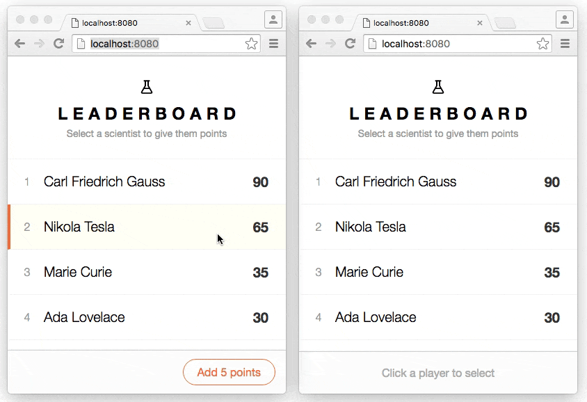

# ShareDB

  [](https://npmjs.org/package/sharedb)
  [](https://travis-ci.org/share/sharedb)
  [](https://coveralls.io/github/share/sharedb?branch=master)

ShareDB is a realtime database backend based on [Operational Transformation
(OT)](https://en.wikipedia.org/wiki/Operational_transformation) of JSON
documents. It is the realtime backend for the [DerbyJS web application
framework](http://derbyjs.com/).

For questions, discussion and announcements, join the [ShareJS mailing
list](https://groups.google.com/forum/?fromgroups#!forum/sharejs).

Please report any bugs you find to the [issue
tracker](https://github.com/share/sharedb/issues).


## Features

- Realtime synchronization of any JSON document
- Concurrent multi-user collaboration
- Synchronous editing API with asynchronous eventual consistency
- Realtime query subscriptions
- Simple integration with any database - [MongoDB](https://github.com/share/sharedb-mongo), [PostgresQL](https://github.com/share/sharedb-postgres) (experimental)
- Horizontally scalable with [pub/sub integration](#pubsub-adapters)
- Projections to select desired fields from documents and operations
- Middleware for implementing access control and custom extensions
- Ideal for use in browsers or on the server
- Reconnection of document and query subscriptions
- Offline change syncing upon reconnection
- In-memory implementations of database and pub/sub for unit testing

## Example apps

[
Simple app demonstrating realtime sync](examples/counter)

[
Leaderboard app demonstrating live queries](examples/leaderboard)

## Data model

In ShareDB's view of the world, every document has 3 properties:

- **version** - An incrementing number starting at 0
- **type** - An OT type. OT types are defined in
[share/ottypes](https://github.com/share/ottypes). Documents
which don't exist implicitly have a type of `null`.
- **data** - The actual data that the document contains. This must be pure
acyclic JSON. Its also type-specific. (JSON type uses raw JSON, text documents
use a string, etc).

ShareDB implicitly has a record for every document you can access. New documents
have version 0, a null type and no data. To use a document, you must first
submit a *create operation*, which will set the document's type and give it
initial data. Then you can submit editing operations on the document (using
OT). Finally you can delete the document with a delete operation. By
default, ShareDB stores all operations forever - nothing is truly deleted.

## Server API

### Initialization

First, create a ShareDB server instance:

```js
var ShareDB = require('sharedb');
var share = new ShareDB(options);
```

__Options__

* `options.db` _(instance of `ShareDB.DB`)_
  Store documents and ops with this database adapter. Defaults to `ShareDB.MemoryDB()`.
* `options.pubsub` _(instance of `ShareDB.PubSub`)_
  Notify other ShareDB processes when data changes
  through this pub/sub adapter. Defaults to `ShareDB.MemoryPubSub()`.

#### Database Adapters
* `ShareDB.MemoryDB`, backed by a non-persistent database with no queries
* [`ShareDBMongo`](https://github.com/share/sharedb-mongo), backed by a real Mongo database
  and full query support
* [`ShareDBMingoMemory`](https://github.com/share/sharedb-mingo-memory), backed by
  a non-persistent database supporting most Mongo queries. Useful for faster
  testing of a Mongo-based app.
* [`ShareDBPostgres`](https://github.com/share/sharedb-postgres), backed by PostgresQL. No query support.

#### Pub/Sub Adapters
* `ShareDB.MemoryPubSub` can be used with a single process
* [`ShareDBRedisPubSub`](https://github.com/share/sharedb-redis-pubsub) can be used
  with multiple processes using Redis' pub/sub mechanism

Community Provided Pub/Sub Adapters
* [wsbus](https://github.com/dmapper/sharedb-wsbus-pubsub)

### Listening to WebSocket connections

```js
var WebSocketJSONStream = require('websocket-json-stream');

// 'ws' is a websocket server connection, as passed into
// new (require('ws').Server).on('connection', ...)
var stream = new WebSocketJSONStream(ws);
share.listen(stream);
```

For transports other than WebSockets, expose a duplex
stream that writes and reads JavaScript objects. Then
pass that stream directly into `share.listen`.

### Middlewares

Middlewares let you hook into the ShareDB server pipeline. In
middleware code you can read and also modify objects as they
flow through ShareDB. For example,
[sharedb-access](https://github.com/dmapper/sharedb-access) uses middlewares
to implement access control.

`share.use(action, fn)`
Register a new middleware.

* `action` _(String)_
  One of:
  * `'connect'`: A new client connected to the server.
  * `'op'`: An operation was loaded from the database.
  * `'doc'`: A snapshot was loaded from the database.
  * `'query'`: A query is about to be sent to the database
  * `'submit'`: An operation is about to be submited to the database
  * `'apply'`: An operation is about to be applied to a snapshot
    before being committed to the database
  * `'commit'`: An operation was applied to a snapshot; The operation
    and new snapshot are about to be written to the database.
  * `'after submit'`: An operation was successfully submitted to
    the database.
  * `'receive'`: Received a message from a client
* `fn` _(Function(request, callback))_
  Call this function at the time specified by `action`.
  `request` contains a subset of the following properties, as relevant for the action:
  * `action`: The action this middleware is handing
  * `agent`: An object corresponding to the server agent handing this client
  * `req`: The HTTP request being handled
  * `collection`: The collection name being handled
  * `id`: The document id being handled
  * `query`: The query object being handled
  * `op`: The op being handled

### Projections

ShareDB supports exposing a *projection* of a real collection, with a specified (limited) set of allowed fields. Once configured, the projected collection looks just like a real collection - except documents only have the fields you've requested. Operations (gets, queries, sets, etc) on the fake collection work, but you only see a small portion of the data.

`addProjection(name, collection, fields)`
Configure a projection.

 * `name` The name of the projected collection.
 * `collection` The name of the existing collection.
 * `fields` A map (object) of the allowed fields in documents.
   * Keys are field names.
   * Values should be `true`.

For example, you could make a `users_limited` projection which lets users view each other's names and profile pictures, but not password hashes. You would configure this by calling:

```js
share.addProjection('users_limited', 'users', { name:true, profileUrl:true });
```

Note that only the [JSON0 OT type](https://github.com/ottypes/json0) is supported for projections.

### Shutdown

`share.close(callback)`
Closes connections to the database and pub/sub adapters.

## Client API

The client API can be used from either Node or a browser. First, get a `ShareDB.Connection` object by connecting to the ShareDB server instance:

From Node:
```js
// `share` should be a ShareDB server instance
var connection = share.connect();
```

To use ShareDB from a browser, use a client bundler like Browserify or Webpack. The following
code connects to the ShareDB server instance over WebSockets:
```js
var ShareDB = require('sharedb/lib/client');
var socket = new WebSocket('ws://localhost:8080');
var connection = new ShareDB.Connection(socket);
```

For transports other than WebSockets, create an object implementing
the WebSocket specification and pass it into the `ShareDB.Connection` constructor.

### Class: `ShareDB.Connection`

`connection.get(collectionName, documentId)`
Get a [`ShareDB.Doc`](#class-sharedbdoc) instance on a given collection and document ID.

`connection.createFetchQuery(collectionName, query, options, callback)`
`connection.createSubscribeQuery(collectionName, query, options, callback)`
Get query results from the server. `createSubscribeQuery` also subscribes to
changes. Returns a [`ShareDB.Query`](#class-sharedbquery) instance.

* `query` _(Object)_
  A descriptor of a database query with structure defined by the database adapter.
* `callback` _(Function)_
  Called with `(err, results)` when server responds, or on error.
* `options.results` _(Array)_
  Prior query results if available, such as from server rendering.
* `options.*`
  All other options are passed through to the database adapter.

### Class: `ShareDB.Doc`

`doc.type` _(String_)
The [OT type](https://github.com/ottypes/docs) of this document

`doc.id` _(String)_
Unique document ID

`doc.data` _(Object)_
Document contents. Available after document is fetched or subscribed to.

`doc.fetch(function(err) {...})`
Populate the fields on `doc` with a snapshot of the document from the server.

`doc.subscribe(function(err) {...})`
Populate the fields on `doc` with a snapshot of the document from the server, and
fire events on subsequent changes.

`doc.ingestSnapshot(snapshot, callback)`
Ingest snapshot data. This data must include a version, snapshot and type. This method is generally called interally as a result of fetch or subscribe and not directly. However, it may be called directly to pass data that was transferred to the client external to the client's ShareDB connection, such as snapshot data sent along with server rendering of a webpage.

`doc.destroy()`
Unsubscribe and stop firing events.

`doc.on('load', function() {...})`
The initial snapshot of the document was loaded from the server. Fires at the
same time as callbacks to `fetch` and `subscribe`.

`doc.on('create', function(source) {...})`
The document was created. Technically, this means it has a type. `source` will be `false` for ops received from the server and defaults to `true` for ops generated locally.

`doc.on('before op'), function(op, source) {...})`
An operation is about to be applied to the data. `source` will be `false` for ops received from the server and defaults to `true` for ops generated locally.

`doc.on('op', function(op, source) {...})`
An operation was applied to the data. `source` will be `false` for ops received from the server and defaults to `true` for ops generated locally.

`doc.on('del', function(data, source) {...})`
The document was deleted. Document contents before deletion are passed in as an argument. `source` will be `false` for ops received from the server and defaults to `true` for ops generated locally.

`doc.on('error', function(err) {...})`
There was an error fetching the document or applying an operation.

`doc.removeListener(eventName, listener)`
Removes any listener you added with `doc.on`. `eventName` should be one of `'load'`, `'create'`, `'before op'`, `'op'`, `'del'`, or `'error'`. `listener` should be the function you passed in as the second argument to `on`. Note that both `on` and `removeListener` are inherited from [EventEmitter](https://nodejs.org/api/events.html#events_class_eventemitter).

`doc.create(data[, type][, options][, function(err) {...}])`
Create the document locally and send create operation to the server.
* `data` Initial document contents
* `type` _([OT type](https://github.com/ottypes/docs))_
  Defaults to `'ot-json0'`, for which `data` is an Object
* `options.source` Argument passed to the `'create'` event locally. This is not sent to the server or other clients. Defaults to `true`.

`doc.submitOp(op, [, options][, function(err) {...}])`
Apply operation to document and send it to the server.
`op` structure depends on the document type. See the
[operations for the default `'ot-json0'` type](https://github.com/ottypes/json0#summary-of-operations).
Call this after you've either fetched or subscribed to the document.
* `options.source` Argument passed to the `'op'` event locally. This is not sent to the server or other clients. Defaults to `true`.

`doc.del([options][, function(err) {...}])`
Delete the document locally and send delete operation to the server.
Call this after you've either fetched or subscribed to the document.
* `options.source` Argument passed to the `'del'` event locally. This is not sent to the server or other clients. Defaults to `true`.

`doc.whenNothingPending(function(err) {...})`
Invokes the given callback function after

 * all ops submitted via `doc.submitOp` have been sent to the server, and
 * all pending fetch, subscribe, and unsubscribe requests have been resolved.

Note that `whenNothingPending` does NOT wait for pending `model.query()` calls.

### Class: `ShareDB.Query`

`query.ready` _(Boolean)_
True if query results are ready and available on `query.results`

`query.results` _(Array)_
Query results, as an array of [`ShareDB.Doc`](#class-sharedbdoc) instances.

`query.extra` _(Type depends on database adapter and query)_
Extra query results that aren't an array of documents. Available for certain database adapters and queries.

`query.on('ready', function() {...}))`
The initial query results were loaded from the server. Fires at the same time as
the callbacks to `createFetchQuery` and `createSubscribeQuery`.

`query.on('error', function(err) {...}))`
There was an error receiving updates to a subscription.

`query.destroy()`
Unsubscribe and stop firing events.

`query.on('changed', function(results) {...}))`
(Only fires on subscription queries) The query results changed. Fires only once
after a sequence of diffs are handled.

`query.on('insert', function(docs, atIndex) {...}))`
(Only fires on subscription queries) A contiguous sequence of documents were added to the query result array.

`query.on('move', function(docs, from, to) {...}))`
(Only fires on subscription queries) A contiguous sequence of documents moved position in the query result array.

`query.on('remove', function(docs, atIndex) {...}))`
(Only fires on subscription queries) A contiguous sequence of documents were removed from the query result array.

`query.on('extra', function() {...}))`
(Only fires on subscription queries) `query.extra` changed.


<!-- Old docs from LiveDB:

## Using ShareDB

### Creating documents

To create a document, you need to submit a create operation to the
document to set its type. In sharedb's world, a document doesn't exist until it
has a type set.

A create operation looks like this: `{create:{type:TYPE, [data:INITIAL DATA]}, [v:VERSION]}`. The type should be something accessible in the map returned by require('ottypes'), for example `json0` or `http://sharejs.org/types/textv1`. Specifying initial data is optional. If provided, it is passed to the type's `create()` method. This does what you expect - for JSON documents, pass your initial object here. For text documents, pass a string containing the document's contents. As with all operations, the version is optional. You probably don't want to specify the version for a create message.

To submit any changes to documents, you use `sharedb.submit(cName, docName, opData, callback)`.

For example:

```javascript
sharedb.submit('users', 'fred', {create:{type:'json0', data:[1,2,3]}}, function(err, version, transformedByOps, snapshot) {
  // I made a document, ma!
});
```

Since documents implicitly exist with no type at version 0, usually the create
message will increment the version from 0 to 1. Not all documents you want to
delete have a version of 0 - if a document is deleted, it will retain its
version.

### Deleting documents

Deleting documents is similar to creating them. A deleted document has no type
and no data, but will retain its version (actually, the delete operation will
bump the document's version). A delete operation looks like this:
`{del:true, [v:VERSION]}`.

You use the same submit function as above to delete documents:

```javascript
sharedb.submit('users', 'fred', {del:true}, function(err) {
  //goneskies! Kapow!
});
```

### Editing documents

You edit a document by submitting an operation. Operations are OT type-specific
JSON blobs. Refer to the documentation on the particular OT type for details.
For example, text documents are documented
[here](https://github.com/share/ottypes/blob/master/lib/text.js#L10-L16). If we
had a text document stored in LiveDB and wanted to edit it, it might look like
this:

```javascript
sharedb.submit('love letters', 'dear fred', {op:[6, "You never return my calls!"], v:1002}, function(err) {
  // ...
});
```

You should always specify the version when submitting edit operations. The
version is technically optional - if its missing, your operation will be
submitted against the most recent version of the document in the server. This
is useful for creating a document which may already exist, but for normal edits
you should always specify the expected current version of the document.


### Getting a document

You can fetch the most recent version of a document using `sharedb.fetch(cName, docName, callback)` or
`sharedb.bulkFetch(request, callback)`. This will fetch the document(s) from the snapshot database
and fetch all operations which may or may not have been committed.

Fetch returns a snapshot data object via its callback. The snapshot data object
has the following fields:

- **v:** version. This is an integer (starting at 0) containing the version of the document
- **type:** Document type, if set. This field is missing if the document does not exist.
- **data:** The document's actual data. For JSON documents this is a JSON tree.
  For text documents this is a string. This field is missing if the document does not exist.

```javascript
sharedb.fetch('users', 'fred', function(err, snapshot) {
  // snapshot has {v:123, type:'...', data:{name:'Fred Flintstone'}}
  // If the document doesn't exist, only the v:version field will exist in the data.
});
```

If you need to get many documents, its more efficient to issue bulk fetches. To
pass the set of requested documents to bulkFetch, you need to make a request
object which maps collection names to lists of documents you want in that
collection. For example, to get 'red', 'green' and 'blue' from the colors
collection, you would make a bulkFetch request of `{colors:['red', 'green',
'blue']}`.

The response maps each collection name to a set of snapshots. Each set of
snapshots maps document names to snapshot data objects. Continuing our colors
example above, the response could be `{colors:{red:{v:0}, green:{v:10, type:..., data:"emerald"}, blue:{v:1, type:..., data:{favorite:true}}}}`.

For example:

```javascript
sharedb.bulkFetch({users:['fred', 'wilma', 'homer'], admins:['zerocool']}, function(err, results) {
  // results will be {users:{fred:..., wilma:..., homer:...}, admins:{zerocool:...}}.
  // Each document has v and optional type and data fields like fetch (above).
});
```


### Getting historic changes to a document

You can get old versions of a document (for playback or catching up a client)
using `sharedb.getOps(cName, docName, from, to, callback)`. This will return
all operations which have been applied to the named document in the requested range.
The range is *open*, so `getOps('users', 'fred', 0, 3, ..)` will return all
operations up to (but not including) 3. (Ie, operations 0, 1 and 2).

If you set the *to* field to null, getOps will get all operations up to the
current version.

ShareDB documents always start at version 0, so you can get a document's entire history using `getOps('users', fred', 0, null, callback);`.

If you set *to* to a version in the future, behaviour is not defined.

Example usage:

```javascript
sharedb.submit('users', 'fred', {create:{type:'json0', data:{name:'Fred'}}}, function(err) {
  sharedb.submit('users', 'fred', {v:1, op:[{p:['name', 4], si:' Flintstone'}]}, function(err) {
    // ...
  });
});

// Sometime later...

sharedb.getOps('users', 'fred', 0, null, function(err, ops) {
  // ops contains the two operations which were submitted above:
  // [{v:0, create:{...}, {v:1, op:[...]}]
});
```

### Streaming changes to a document in realtime

You can subscribe to changes from a document using
`sharedb.subscribe(cName, docName, v, callback)` or
`sharedb.bulkSubscribe(request, callback)`. When you subscribe, you get an
operation stream which gets packed with operations as they happen.

When you subscribe to a document, you need to specify which version you're
subscribing to the document *from*. The version cannot be in the future.

The stream will be populated with each operation from the requested version
onwards (to infinity and beyond). Each operation will appear in the stream
exactly once. If you subscribe and request an old document version, all
operations from that version to the current version will be buffered in the
stream before the stream is returned to the callback.

You usually want to call *subscribe* after fetching a document. Pass the
document version that you got from calling *fetch* into your call to
*subscribe*.

For example:

```javascript
sharedb.fetch('users', 'fred', function(err, data) {
  if (err) { ... }
  var version = data.v;

  // ... Any amount of time later (literally).
  sharedb.subscribe('users', 'fred', version, function(err, stream) {
    if (err) { ... }

    // stream is a nodejs ReadableStream with all operations that happen to
    // users.fred.

    stream.on('data', function(opData) {
      // The opData is a JSON object, the same object you can pass to submit().
      // It always has a v: field.

      // ShareDB exports a helper function to apply the operation to some
      // snapshot data:
      var err = ldb.ot.apply(data, opData);
      if (err) { ... }
    });
  });
});
```

**Important!** To avoid leaking memory, when you're done with a stream call `stream.destroy()` to clean it up.

There is a helper method which will both fetch and subscribe for you (cleverly
called `fetchAndSubscribe(cName, docName, callback)`). It is defined like this:

```javascript
ShareDB.prototype.fetchAndSubscribe = function(cName, docName, callback) {
  var self = this;
  this.fetch(cName, docName, function(err, data) {
    if (err) return callback(err);
    self.subscribe(cName, docName, data.v, function(err, stream) {
      callback(err, data, stream);
    });
  });
};
```

It calls your callback with `(err, snapshot, stream)`, giving you both the current document snapshot and the stream of operations from the current version.

#### Bulk Subscribe

If you want to subscribe to multiple documents at once, you should call
`bulkSubscribe(request, callback)`. The bulk subscribe request is a map from
cName -> map from docName -> version. For example, `{colors: {red:5, blue:6,
green:0}}`. The response is a map from cName -> map from docName -> stream.
For example, `{colors: {red:<stream>, blue:<stream>, green:<stream>}}`.
bulkSubscribe will either return a stream for all requested objects or (if
there was an error), none of them.

Again, remember to call `stream.destroy()` on all streams returned by bulk
subscribe when you're done with them.


### Queries

ShareDB supports running live queries against the database. It can re-run queries when it suspects that a query's results might have changed - and notify the caller with any changes to the result set.

This is incredibly inefficient and I want to completely rewrite / rework them. For now, I recommend against using live bound queries in a production app with a decent load. I'll document them when I'm happier with them.


### Projections

ShareDB supports exposing a *projection* of a real collection, with a specified
(limited) set of allowed fields. Once configured, the projected collection
looks just like a real collection - except documents only have the fields
you've requested.

Operations (gets, queries, sets, etc) on the fake collection work, but you only
see a small portion of the data. You can use this to drop server & db load
dramatically and speed up page times. Its similar to SQL VIEWs. For now, this
only works on JSON documents. (I don't know what it would look like for text
documents).

For example, you could make a `users_limited` projection which lets users view
each other's names and profile pictures, but not password hashes. You would
configure this by calling:

```javascript
sharedb.addProjection('users_limited', 'users', 'json0', {name:true, profileUrl:true});
```

However, be aware that on its own **this is not sufficient for access control**. If
users are still allowed to make arbitrary mongo queries against the projected
collection, they can find out any data in the hidden fields.

Configure a projection by calling `addProjection(projCName, realCName, type, fields)`.

- **projCName:** The projected collection name. (Eg, `users_limited`)
- **realCName:** The underlying collection name
- **type:** The OT type. Only JSON0 is supported for now.
- **fields:** A map of the allowed fields in documents. The keys in this map
  represent the field names, and the values should be `true`.

Limitations:

- You can only whitelist fields (not blacklist them).
- Projections can only limit / allow fields at the top level of the document

-->

## Error codes

ShareDB returns errors as plain JavaScript objects with the format:
```
{
  code: 5000,
  message: 'ShareDB internal error'
}
```

Additional fields may be added to the error object for debugging context depending on the error. Common additional fields include `collection`, `id`, and `op`.

### 4000 - Bad request

* 4001 - Unknown error type
* 4002 - Database adapter does not support subscribe
* 4003 - Database adapter not found
* 4004 - Missing op
* 4005 - Op must be an array
* 4006 - Create data in op must be an object
* 4007 - Create op missing type
* 4008 - Unknown type
* 4009 - del value must be true
* 4010 - Missing op, create or del
* 4011 - Invalid src
* 4012 - Invalid seq
* 4013 - Found seq but not src
* 4014 - op.m invalid
* 4015 - Document does not exist
* 4016 - Document already exists
* 4017 - Document was deleted
* 4018 - Document was created remotely
* 4019 - Invalid protocol version
* 4020 - Invalid default type
* 4021 - Invalid client id
* 4022 - Database adapter does not support queries
* 4023 - Cannot project snapshots of this type

### 5000 - Internal error

The `41xx` and `51xx` codes are reserved for use by ShareDB DB adapters, and the `42xx` and `52xx` codes are reserved for use by ShareDB PubSub adapters.

* 5001 - No new ops returned when retrying unsuccessful submit
* 5002 - Missing snapshot
* 5003 - Snapshot and op version don't match
* 5004 - Missing op
* 5005 - Missing document
* 5006 - Version mismatch
* 5007 - Invalid state transition
* 5008 - Missing version in snapshot
* 5009 - Cannot ingest snapshot with null version
* 5010 - No op to send
* 5011 - Commit DB method unimplemented
* 5012 - getSnapshot DB method unimplemented
* 5013 - getOps DB method unimplemented
* 5014 - queryPollDoc DB method unimplemented
* 5015 - _subscribe PubSub method unimplemented
* 5016 - _unsubscribe PubSub method unimplemented
* 5017 - _publish PubSub method unimplemented
* 5018 - Required QueryEmitter listener not assigned
