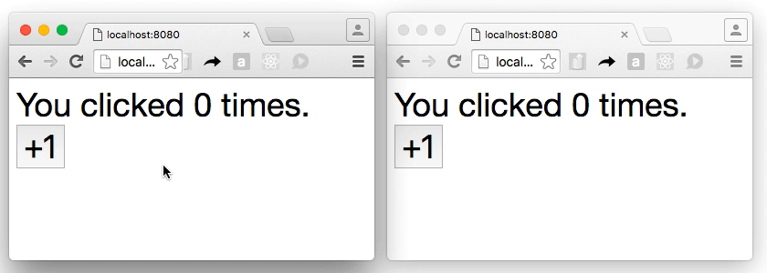

# Simple realtime client/server sync with ShareDB (ottype json1)



This is a simple websocket server that exposes the ShareDB protocol,
with a client showing an incrementing number that is sychronized
across all open browser tabs.

In this demo, data is not persisted. To persist data, run a Mongo
server and initialize ShareDB with the
[ShareDBMongo](https://github.com/share/sharedb-mongo) database adapter.

## Install dependencies
```
npm install
```

## Build JavaScript bundle and run server
```
npm run build && npm start
```

## Run app in browser
Load [http://localhost:8080](http://localhost:8080)
